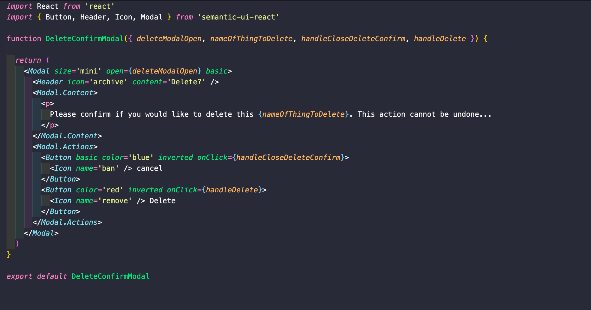

# SEI project four - JOBR

### Table of contents 
- Project Overview
- The Brief
- Technologies Used
- Approach Taken - (featured code)
- Final Product - (screenshot walkthrough)
- Wins & Blockers
- Bugs
- Future Content and Improvements
- Key Learnings

---

# Overview
JOBR is a Job search toolkit helping job seekers keep organised throughout their search for a new role. This is a full stack project and my first experience using Python and Django as the back-end. The whole application was built and delivered over 8 days in a group of three devs.

## You will find the deployed app here: **[JOBR](https://jobrrr.herokuapp.com/)**

To see the full features for JOBR, please feel free to login using the following credentials:

email: jobseeker@email.com\
password: pass

## Code Installation:
Clone or download the repo then do the following in Terminal:

- Install back-end dependencies:  `pipenv`
- Enter Shell for project: `pipenv shell`
- Make Migrations: `python manage.py makemigrations`
- Migrate: `python manage.py migrate`
- Load Seed data for Job Statuses: `python manage.py loaddata job_status/seeds.json`
- Load Seed data for Task Categories: `python manage.py loaddata task_categories/seeds.json`
- Start back-end server: `python manage.py runserver`
- Change into front-end directory: `cd frontend`
- Install front-end dependencies: `yarn`
- Start front-end server: `yarn start`

---

# The Brief
* **Build a full-stack application** by making your own backend and your own front-end
* **Use a Python Django API** using Django REST Framework to serve your data from a Postgres database
* **Consume your API with a separate front-end** built with React
* **Be a complete product** which most likely means multiple relationships and CRUD functionality for at least a couple of models
* **Implement thoughtful user stories/wireframes** that are significant enough to help you know which features are core MVP and which you can cut
* **Be deployed online** so it's publicly accessible.

# Technologies Used
### Backend:
- Python
- Django
- Django REST Framework
- Psycopg2
- pyJWT

### Frontend:
- React
- Axios
- Semantic UI React
- SCSS
- Http-proxy-middleware
- Nodemon
- React Router Dom
- React Semantic UI Datepicker

### Development tools:
- VS code
- Yarn
- Insomnia
- Git
- Github
- Google Chrome dev tools
- Heroku (deployment)
- Trello Board (planning and timeline)
- Miro Board (wireframing)
- Coolers (colour theme)
- Zoom
- Slack

# Approach Taken 

## Planning (day 1):
As a group we decided very quickly on the idea of JOBR for this project and that we all wanted to be involved in the full-stack development of the app. We also decided early on that we should develop it to be fully responsive initially built mobile first. With that in mind we used MIRO to create a storyboard/wireframe as well as plan for the models we required and the relationships between them. 

**Storyboard:**

**Relationships:**

We decided early on to keep a high level of communication throughout the project. We started each day with a 30-minute stand up discussion where we would talk about our current tasks and if we had any blockers. We were then on a Zoom meeting and Slack throughout the day so we could keep in contact should we need any quick bug fixing etc. We used Git and GitHub for version control and decided for the first few days to do our pushes and pulls together to aviod any potential Git issues or merge conflicts that may arise. We delegated the work evenly between us and used Trello to create a to-do list that we would all keep on top of throughout the project.

**Trello Board:**

---
## Back-end (day 2 & 3): 
This was my first experience of creating a back-end using Python. We used Django and Django REST Framework to create a PostgreSQL database with RESTful features. In total we had 7 models. I took charge of creating the Users/Authorisation model as well as contacts and resources models. I found using Django was very straight forward and an efficient process to create the PostgreSQL database. As our app was a single user experience all of the views for Jobs, Tasks, Contacts & Resources were filtered results based on the currently logged in user. By the end of day 2 we were ready to start testing all models using Insomnia - making sure all relationships between models were correct and that we were receiving the correct JSON responses. This was completed and tested by the middle of Day 3. 

**Featured Code - Resources views:**

---

## Front-end (days 3, 4, 5, 6, 7 & 8)
For the front-end we used React Hooks throughout. I took charge of creating the Jobs, Navbar, Contacts and Resources pages. We used Axios for the data requests from the back-end, creating an API request library that was imported in to each relevent page. React-router-dom was used for page navigation in React. We decided to use Semantic UI styling framework as it appeared to be a slightly lighter weight than Bulma which we had all previously used. and our plan was to build with this in mind so in the final two days we would be able to.

**JobIndex page:**\
For the Jobs Index page there were multiple views that needed to be created based on which ever device the user was using. For example, on desktop all 5 job category columns were visible, on tablet only 2/3 are visable and on mobile only one column could be viewed at a time. Because of these multiple views and needing to be able to switch between columns, I found a public React Hook that would take into account the viewport width and render the page based on this. I then created the mulitple views and the functions to switch between each view - again dependant on the current screen width. This ended up working very well however, I would like to add swipeable functionality to the mobile and tablet views for a nicer user experience.

For the desktop view I also created a drag and drop feature, which would enable a user to drag a job from one category to another. This ended up working very well and is a feature I am proud of. However, again through some better styling I think I could make the process a little slicker looking. Below is a code snippet of the function that occurs upon drop of the selected job:

**Featured Code - dropEvent Function for Drag-n-Drop**

**Contacts & Resources:**\
For both Contacts and Resources index pages the same simple responsive design was used. I added a search bar to the Contacts page where you are able to search out by the name/job/company of the contact using RegEx for the filtering.

**Delete Confirm Modal (re-usable hooks component):**\
Using Semantic UI's Modal - I created a re-usable Hook component - This was used throughout the app upon deletion of any Job, Task, Contact and Resource - The modal would appear asking the user to confirm they intended to delete the item. Adding this to each page was very simple and a case of passing the component 4 props and creating the functions and state to open and close the Modal. 

**Featured Code - Delete Confirm Modal**

**Adding Delete Confirm Modal to Component**

**Navbar:**
This was created very simply by using Semantic UI's Menu feature. We wanted a simple menu that would be the same on mobile as it is on desktop/tablet.

---

## Styling (days 7 & 8)
As I mentioned, we used Semantic UI for the styling however, many of the components I created I ended up styling myself using SASS. I feel very comfortable with Flexbox and creating responsive pages so I was happy to do this myself across JobIndex, Contact and Resources. I feel that sometimes you can end up fighting against CSS frameworks such as Semantic as they can be hard to customise and for efficiency I took the self styling route. However these frameworks are often their most useful when you need items such as buttons, forms or modals. For the Final two days I was making sure that all styling and fonts etc were on brand and within the colourscheme we had chosen. 

# Final Product - Screenshot Walkthrough
**Home Page:**

**JobIndex:**

**JobShow:**

**Delete Modal:**

**Tasks:**

**Contacts:**

**Resourcess:**

# Wins & Blockers
### **Wins:**
- Simple and functional working responsive design across multiple platforms - Very happy with this as I feel most users would end up using this on their Mobile device just as much if not more than on a desktop. 
- Using Hooks throughout was a challenge, however, I found it a rather easy switch to this more modern syntax.
### **Blockers:**
- Initially I took quite a while to work out how I was going to get the jobs index and job boards switching nicely on Mobile and Tablet views. Ideally I would have liked to have added in swipeable views, however, due to time constraints I decided it was best to get it working on button presses and not dwell too much and move onto the next feature. Swipeable was added to the Nice To Haves list and unfortunately not implemented.

# Bugs
- When you have added a new task, the form is not automatically cleared and you have to reload the page to clear it to add a new task. (fixed)
- Mobile landscape view is not working at all so some media queries and additional styling is needed here.
- Currently not able to update Resources or Contacts, only Create and Delete.

# Future Content & Improvements
- The ability to share your job search board with career coach
- Progressive Web App functionality
- Swipeable views on Mobile/Tablet view
- Drag n Drop to work on mobile/tablet views

# Key Learnings
This project has really helped me gain a much stronger understanding of relational databases and has lead me down the path of learning more Python. Initially while learning it, I didn't like using Django to create the back-end as it felt a little too controlled however, after using it in this project I can see how quick and effective it has been so will definitely use it again on a future project. 